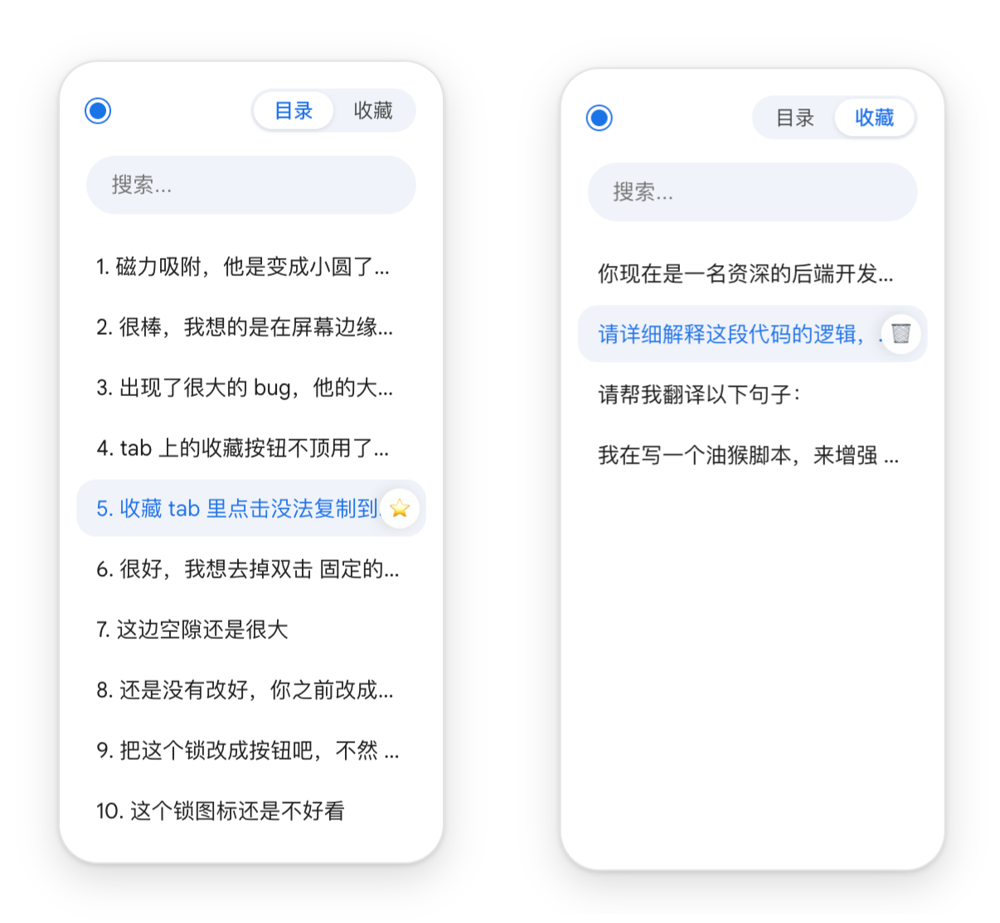
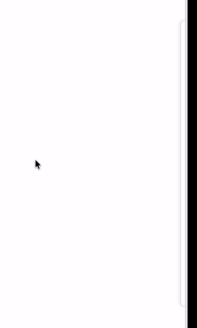
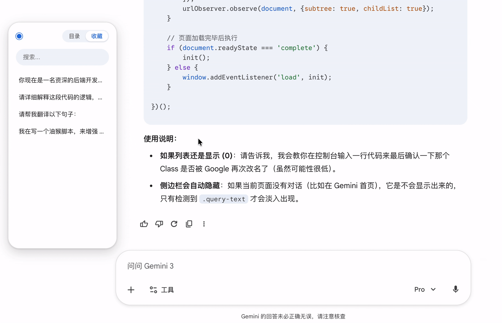

# 🚀 Gemini Pro Panel - 你的 Google Gemini 效率增强神器

让 Gemini 更好用的油猴脚本。支持历史对话回溯、Prompt 收藏一键发送、侧边栏自动吸附。

## 📸 效果演示 (Preview)

### 1. 全能面板：历史回溯与收藏夹
> 核心界面一览，所有功能触手可及。

  

 

### 2. 自动隐身：用完即走
> 鼠标移开自动吸附到边缘，不打扰你的阅读体验。

  

 

### 3. 效率飞升：收藏 Prompt 一键发送
> 点击收藏夹里的指令，直接填入并发送，告别重复打字。

  

## ✨ 主要功能 (Key Features)

* **📚 历史对话增强 (Context Inspector)**
    * **时光机**：在当前页面直接查看所有的历史 Prompt，快速跳转，不再迷失在长对话中。
    * **全文搜索**：支持关键词搜索，瞬间找到你之前问过的问题（比如搜“Python”或“润色”）。
* **⚡️ Prompt 收藏夹 (Prompt Manager)**
    * **核心功能**：常用的指令（如“翻译成中文”、“润色这段代码”）一键收藏。
    * **一键发送**：点击收藏的 Prompt，直接填入对话框并（可选）自动发送，手速起飞 🚀。
* **🎨 极致 UI 体验**
    * **非侵入式设计**：自动吸附屏幕边缘，鼠标移开自动隐藏，不占用宝贵的阅读空间。
    * **原生感**：适配 Gemini 原生风格，丝般顺滑。
* **🔒 隐私安全 (Privacy First)**
    * **本地存储**：所有数据（收藏、历史索引）仅保存在浏览器本地 (Local Storage)，**绝不上传**任何服务器，安全无忧。

## 📦 如何安装 (Installation)

1.  安装浏览器扩展 [Tampermonkey](https://www.tampermonkey.net/) (油猴)。
2.  👉 [**点击这里一键安装脚本**](https://github.com/Chantec/gemini-pro-panel/raw/refs/heads/main/gemini-panel.user.js) 👈
【或者 手动复制js至扩展中】
3.  刷新 Gemini 页面，即可在右侧看到悬浮面板。
4.  如果chrome安装后无反应，请看下面。

## 安装后无面板

油猴需要执行用户脚本的权限。具体原因及打开步骤见官方文档。

[官方链接](https://www.tampermonkey.net/faq.php#Q209)

## 🛠 使用技巧

* **添加收藏**：在对话流中选中任意文本，或在面板中手动添加。
* **快速搜索**：面板顶部输入关键词，实时过滤历史记录。
* **隐藏面板**：鼠标移出面板区域自动收起，或者点击侧边栏按钮。

## 🗓️ 开发计划 (Roadmap)

- [x] 基础功能：历史回溯、搜索、收藏
- [ ] 支持其他网站(qwen、chatgpt等)
- [ ] 支持数据导出/导入 (JSON 备份)
- [ ] 自定义面板快捷键
- [ ] 更多自定义主题设置

## ⚠️ 免责声明 (Disclaimer)

本项目为个人兴趣开发，与 Google Gemini 官方无关。脚本仅运行在用户本地浏览器，不会收集任何用户隐私数据。

---

**如果觉得好用，请给个 Star ⭐️ 支持一下！**
如果你有好的建议或发现了 Bug，欢迎在Issues中反馈。